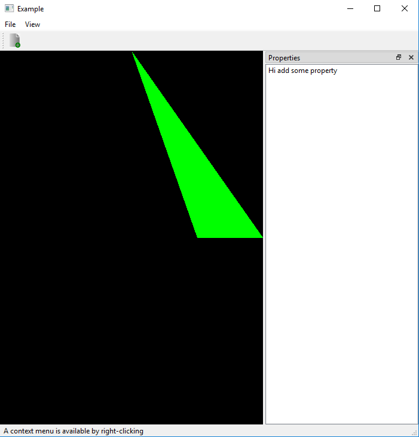

# 03-Opengl-Uniform-Variable

Draw a green triangle:
  1) Use a uniform variable in vertes sahder
  2) Pass color from application to shader
  
Output Image:

References:
1) http://ogldev.atspace.co.uk/www/tutorial03/tutorial03.html
2) https://learnopengl.com/Getting-started/Hello-Triangle
3) http://www.opengl-tutorial.org/beginners-tutorials/tutorial-2-the-first-triangle/

